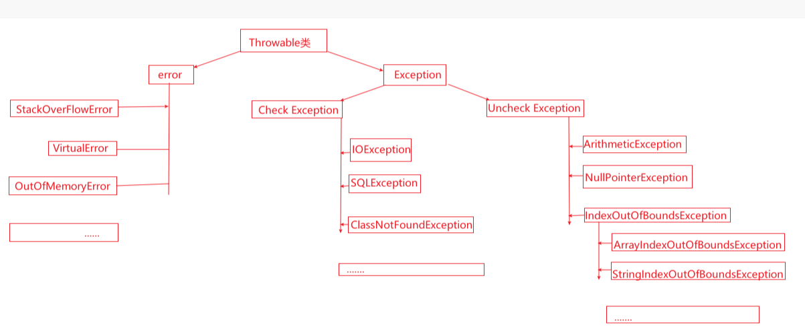
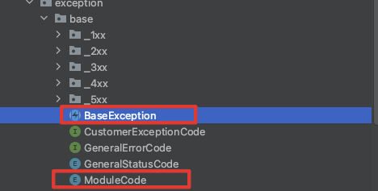
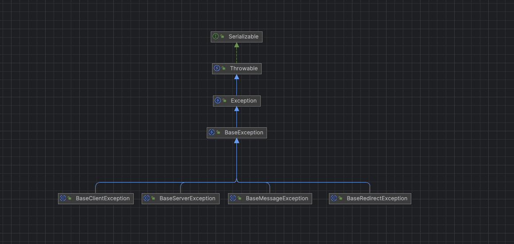
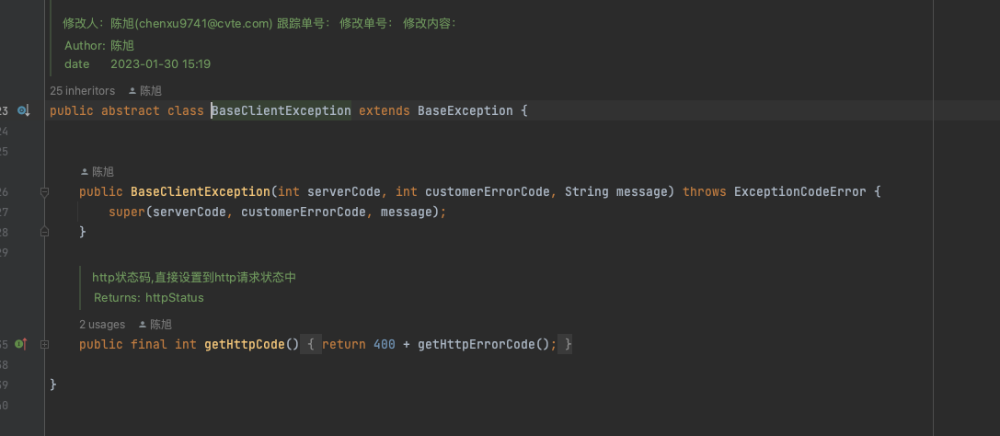
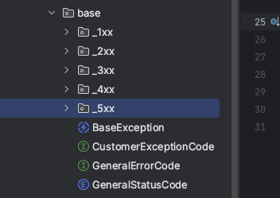
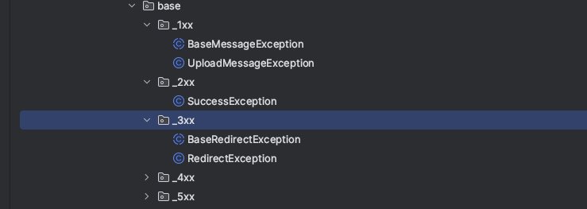
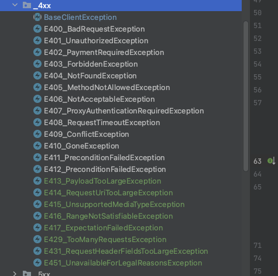
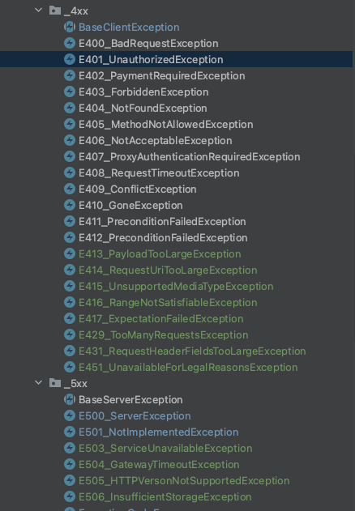

## Java 中的异常体系
异常是程序在运行过程中可能出现的各种非正常情况，异常处理是非常重要的部分，它可以帮助我们更好地理解和管理程序的错误和异常情况。
Java 中有异常体系结构主要有两大类，分为可以 Checked 异常和 UnChecked 的异常

- Checked 异常：是指在编译时必须处理的异常，如果不处理，程序就不能编译通过。如IOException、SQLException 等以及用户自定义的 Exception 异常类都属于 Checked 异常。
- UnChecked 异常：是指在编译时可以不处理的异常，如果不处理，程序也可以编译通过。如 NullPointerException、ArrayIndexOutOfBoundsException 等以及用户自定义的 RuntimeException 异常类都属于 UnChecked 异常。

| 类别 | Checked 异常 | UnChecked 异常 |
| :---: | :---: | :---: |
| 是否需要处理 | 必须处理 | 可以不处理 |
| 是否继承自 Exception | 是 | 否 |
| 是否继承自 RuntimeException | 否 | 是 |
| 是否继承自 Error | 否 | 否 |
| 是否继承自 Throwable | 是 | 是 |

在Java 中，所有的异常都继承自Throwable类，其中Error和Exception是其两个重要的子类。其中，Error类体系包含了Java运行时系统的内部错误和资源耗尽错误，一般情况下我们不处理这类错误。Exception类体系包含其他所有异常，包括Checked异常和Unchecked异常。
同时，Java 中的异常都是类设计，它们只能够单继承；也就是说自定义异常只能继承一种异常类，而不能同时继承多种异常类。因此，Java 中的异常类体系结构如下图所示：



其中 Checked 异常是指在编译时必须处理的异常，而 UnChecked 异常是指在编译时可以不处理的异常。

## JAVA WEB 中的异常设计
在 JAVA WEB 的开发中，返回的永远是正常的返回，其他一切都是异常，异常的设计是非常重要的，它可以帮助我们更好地理解和管理程序的错误和异常情况。

思考一下：如果我们把Java 中的异常和返回给前端的异常码结合在一起，会发生什么呢？

## JAVA WEB 中的异常和错误码绑定在一起

在错误码设计章节中我们提到，错误的信息要和HTTP状态信息维持一致、异常码全局唯一、通过异常码能够快速定位出错的位置，这样的话，方便前后端人员理解。但是这里有几个关键环节
- http的状态码要所有开发人员熟知
- 模块和模块码的对应关系需要大家共同维护
- 开发人员有可能对应关系搞错误

### 具体代设计
#### 如何让开发人员都熟悉HTTP 状态码的含义，并习惯性的使用HTTP的状态码？

##### 1、定义全局模块编码、最顶层的异常类，如下图所示


##### 2、分别把不同的错误类型放在不同包下面
然后定义不同http 状态的异常基类，继承顶层全局的异常类

- BaseMessageException (1xx开头的异常类型)
- BaseSuccessException (2xx开头的异常类型)
- BaseRedirectException (3xx开头的异常类型)
- BaseClientException (4xx开头的异常类型)
- BaseServerException (5xx开头的异常类型)

这些异常分别继承 BaseException,类图如下：





##### 3、编写所有HTTP状态码异常
考虑到开发人员的成本问题，java中采用继承的方式实现错误码的组合，把所有HTTP的状态码使用JAVA写一份，这样开发人员就可以直接使用异常类，而不用关心异常码了。具体设计如下图所示：










#### 把用到的HTTP 错误信息分别写下来，继承各自的异常基类
- E501_NotImplementedException  (501开头的异常类型)
- E401_UnauthorizedException (401开头的错误类型)
  ...

```java

import vip.maxhub.web.md.infrastructure.exception.base._5xx.ExceptionCodeError;

/**
 * 包名：vip.maxhub.web.md.infrastructure.exception.base
 * 文件名：UnauthorizedExecption.class
 * 版权：Copyright by CVTE 公司
 * 描述：
 * 修改人：陈旭(chenxu9741@cvte.com)
 * 跟踪单号：
 * 修改单号：
 * 修改内容：
 *
 * @author 陈旭
 * @group [][] xx
 * @date 2023-03-06 18:40
 **/
public class E401_UnauthorizedException extends BaseClientException {

    public E401_UnauthorizedException(int serverCode, int customerErrorCode,String message) throws ExceptionCodeError {
        super( serverCode, customerErrorCode,message);
    }


    /**
     *  没有认证的HTTP 状态码为401，其中 4 属于 BaseClientException 异常信息，01 属于http 状态码信息，
      */
    @Override
    protected int getHttpErrorCode() {
        return 1;
    }
}


```



#### 2、定义全局模块、系统、服务异常编码，如下所示：
```java

public enum ModuleCode {

    AIR_DISK("01"),
    AUTH("02"),
    DEVICE("03"),
    NOTE("04"),
    RECORD("05"),
    RECORD_SERVER("06"),
    SEEWO_IM("07"),
    SHARE("08"),
    WECHAT("09"),
    DEVICE_BIND("10"),
    ;


    /**
     * 模块码，从01开始，每增加一个模块就递增1
     */
    private final String moduleCode;

    ModuleCode(String moduleCode) {
        this.moduleCode = moduleCode;
    }

    public String getModuleCode() {
        return moduleCode;
    }

    public int getModuleCodeValue(){
        return Integer.parseInt(moduleCode);
    }
}

```

#### 3 模块内定义私有异常信息


异常信息继承全局异常，并填写上模块信息，如下所示
```java

/**
 * 网盘的客户端异常类，
 */
public class AirDiskBaseClientException extends ClientException {

    /**
     * ModuleCode.AIR_DISK.getModuleCodeValue() 这个是网盘模块的全局异常码
     * @param customerErrorCode 自定义异常信息
     * @param message 错误消息
     * @throws ExceptionCodeError 抛出异常检测
     */
    public AirDiskBaseClientException(int customerErrorCode, String message) throws ExceptionCodeError {
        super(message, ModuleCode.AIR_DISK.getModuleCodeValue(), customerErrorCode);
    }
}
```
如AirDisk 模块中的某一项具体的异常类定义如下：
```java

import vip.maxhub.web.md.infrastructure.exception.base.ModuleCode;
import vip.maxhub.web.md.infrastructure.exception.base._5xx.E501_NotImplementedException;
import vip.maxhub.web.md.infrastructure.exception.base._5xx.ExceptionCodeError;

import static vip.maxhub.web.md.business.airdisk.exception.ExceptionCode.REMOTE_CLIENT_EXCEPTION;

/**
 * 包名：vip.maxhub.web.md.business.airdisk.exception
 * 文件名：AirdiskNotImpException.class
 *
 * @author 陈旭
 * @date 2023-03-30 16:14
 **/
public class AirdiskRemoteClientException extends AirDiskBaseClientException {
    public AirdiskRemoteClientException(String message) throws ExceptionCodeError {
        super(REMOTE_CLIENT_EXCEPTION.getCode(), message);
    }
}

```
